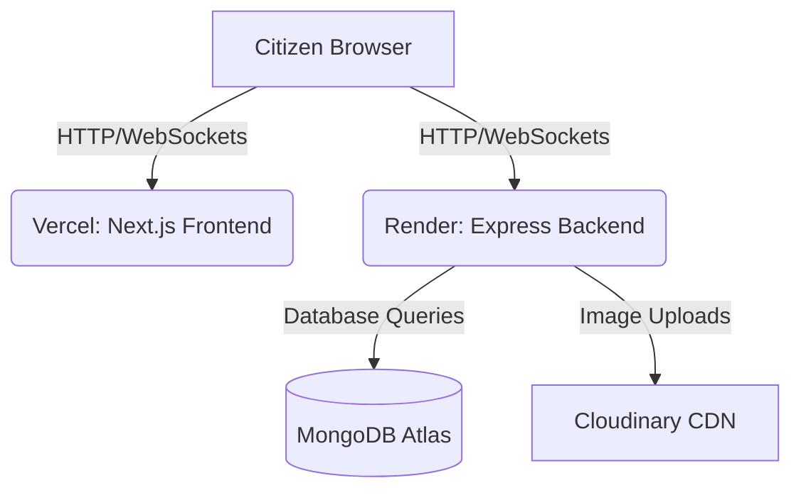

# 🚀 Free Online Deployment Guide

This guide walks you through deploying **Digital Jan Samvad** completely online using free tiers for the frontend (Vercel), backend (Render), database (MongoDB Atlas), and images (Cloudinary).

---

## 🗺️ Architectural Workflow

---

## 1. 🗄️ Database Setup: MongoDB Atlas (Free Tier)
1. Go to [MongoDB Atlas](https://www.mongodb.com/cloud/atlas) and sign up for a free account.
2. Create a new project and select **Create a Cluster** (choose the **M0 Shared** free tier).
3. Select your cloud provider and region (choose the one closest to your users), then click **Create**.
4. In **Security Quickstart**:
   - Create a database user (note down the **username** and **password**).
   - Add `0.0.0.0/0` under **IP Access List** to allow connections from any hosting provider (like Render).
5. Once the cluster is provisioned, click **Connect** -> **Drivers** -> copy the **Connection String** (URI).
   - It will look like: `mongodb+srv://<username>:<password>@cluster0.xxxx.mongodb.net/?retryWrites=true&w=majority`
   - Replace `<username>` and `<password>` with the credentials you created.

---

## 2. 🖼️ Image Storage: Cloudinary (Free Tier)
1. Go to [Cloudinary](https://cloudinary.com/) and register for a free account.
2. Go to your Cloudinary **Console Dashboard**.
3. Locate and copy the following credentials:
   - **Cloud Name** (`CLOUDINARY_CLOUD_NAME`)
   - **API Key** (`CLOUDINARY_API_KEY`)
   - **API Secret** (`CLOUDINARY_API_SECRET`)

---

## 3. 🖥️ Backend Deployment: Render (Free Tier)
1. Commit and push all your project files (including the backend changes) to your GitHub repository.
2. Sign up/log in to [Render](https://render.com/).
3. Click **New +** and select **Web Service**.
4. Connect your GitHub repository.
5. Configure the Web Service settings:
   - **Name**: `digital-jan-samvad-backend`
   - **Language**: `Node`
   - **Root Directory**: `backend`
   - **Build Command**: `npm install`
   - **Start Command**: `npm start`
   - **Instance Type**: Select **Free**
6. Open the **Advanced** dropdown and click **Add Environment Variable** to add the following backend keys:
   - `NODE_ENV` = `production`
   - `PORT` = `10000` (or leave empty, Render assigns it dynamically)
   - `MONGO_URI` = *Your MongoDB Atlas connection URI*
   - `JWT_SECRET` = *Any random secure secret string (e.g., `9f3c7e0b51...`)*
   - `JWT_EXPIRE` = `7d`
   - `CLIENT_URL` = *Your frontend URL (e.g., `https://digital-jan-samvad.vercel.app` - you will get this after deploying to Vercel. You can update this later in Render environment variables).*
   - `CLOUDINARY_CLOUD_NAME` = *Your Cloudinary cloud name*
   - `CLOUDINARY_API_KEY` = *Your Cloudinary API key*
   - `CLOUDINARY_API_SECRET` = *Your Cloudinary API secret*
7. Click **Create Web Service**. Wait for the build and deployment process to complete.
8. Once successfully deployed, copy the Render Web Service URL (e.g., `https://digital-jan-samvad-backend.onrender.com`).

---

## 4. 🎨 Frontend Deployment: Vercel (Free Tier)
1. Go to [Vercel](https://vercel.com/) and sign up with GitHub.
2. Click **Add New** -> **Project**.
3. Import your GitHub repository.
4. Configure the project settings:
   - **Framework Preset**: `Next.js`
   - **Root Directory**: `./` (Root directory, since Next.js structure is in the root)
5. Expand **Environment Variables** and add the following keys:
   - `NEXT_PUBLIC_API_URL` = *The URL of your deployed Render backend (e.g., `https://digital-jan-samvad-backend.onrender.com`)*
   - `NEXT_PUBLIC_APP_URL` = *The URL of your frontend (e.g., `https://<your-project>.vercel.app`)*
   - `NEXT_PUBLIC_APP_NAME` = `Digital Jan Samvad`
6. Click **Deploy**. Vercel will build and launch your Next.js application.
7. Once deployed, note down your production Vercel URL and add/update the `CLIENT_URL` environment variable in your **Render** backend settings to match it. This prevents CORS errors.

---

## 💡 Troubleshooting
* **Cold Starts on Render Free Tier**: Because Render's free tier spins down services after 15 minutes of inactivity, the backend might take 50-60 seconds to boot on the first request after being idle. This is normal behavior.
* **CORS Errors**: If the frontend has trouble communicating with the backend, verify that `CLIENT_URL` in the Render environment variables matches your exact Vercel URL (without a trailing slash) e.g., `https://digital-jan-samvad.vercel.app`.
* **Image Upload Failures**: If images are not uploading, verify that the Cloudinary variables (`CLOUDINARY_CLOUD_NAME`, `CLOUDINARY_API_KEY`, and `CLOUDINARY_API_SECRET`) are correctly defined in Render's environment variables.
